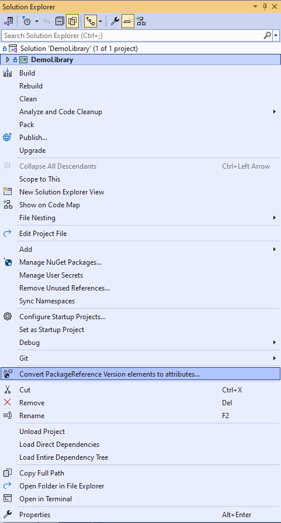

# PackageReference Version to Attribute

This Visual Studio extension and dotnet tool converts `PackageReference` `Version` child elements to attributes in C# project files (`csproj`).

It can also convert all projects in a Visual Studio solution file (`sln`).

## Getting started with the Visual Studio Extension

1. [Download and install the extension from the Visual Studio Marketplace](https://marketplace.visualstudio.com/items?itemName=RamiAbughazaleh.PackageReferenceVersionToAttributeExtension).  
2. Right-click on the root `Solution` node, or one or more projects, and select `Convert PackageReference Version elements to attributes...`.  

   

3. Wait until the process finishes.  
   Check the status bar or the `PackageReferences Version to Attribute Extension` pane in the `Output Window` for details.

## Getting started with the dotnet tool

1. Install the dotnet tool using the following command:  
   ```bash
   dotnet tool install PackageReferenceVersionToAttribute.Tool

2. To convert all csproj files in the current directory and its subdirectories, run the tool with the command:  
   ```bash
   PackageReferenceVersionToAttribute.Tool .\**\*.csproj

3. For additional options and usage, you can run:
   ```bash
   PackageReferenceVersionToAttribute.Tool --help


## Technical details

The extension will create a backup of each project file.  
For example, `MyProject.csproj` will be copied to `MyProject.csproj.bak`.  

If the project file is source controlled, it will be checked out for modification.  

### General

The `Version` child elements of `PackageReference` will be converted to a `Version` attribute.  
For example, the following elements in the `csproj` project file:
```
  <PackageReference Include="Newtonsoft.Json">
    <Version>13.0.3</Version>
  </PackageReference>
```

will be converted to this:
```
  <PackageReference Include="Newtonsoft.Json" Version="13.0.3" />
```

## Rate and Review

Has this extension helped you at all?

If so, please rate and share it.

Thank you! :)